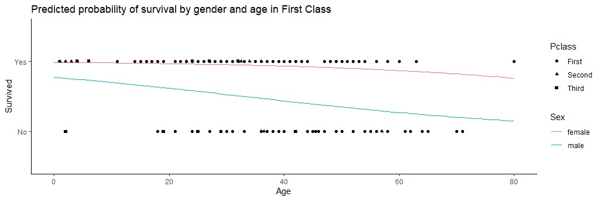

# TITANIC FILE
**this repository contain files which consist of data analysis of the passengers that survived from the famous Titanic**

*the data analysis consist of:-*
1. passengers' survival count and the proportion
2. passengers' social class count
3. proportion of passengers survived by social class
4. Age of passengers
5. predicted probability of survival by gender and age in First Class
6. predicted probability of survival of male passengers by passenger class and age

------------------------------------------------------------------------------------------

below is a graph of the predicted probability of survival by gender and age in First Class

__________________________________________________________________________________________

thank you for reading! :smile:
